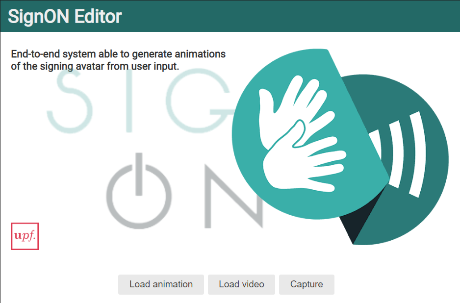
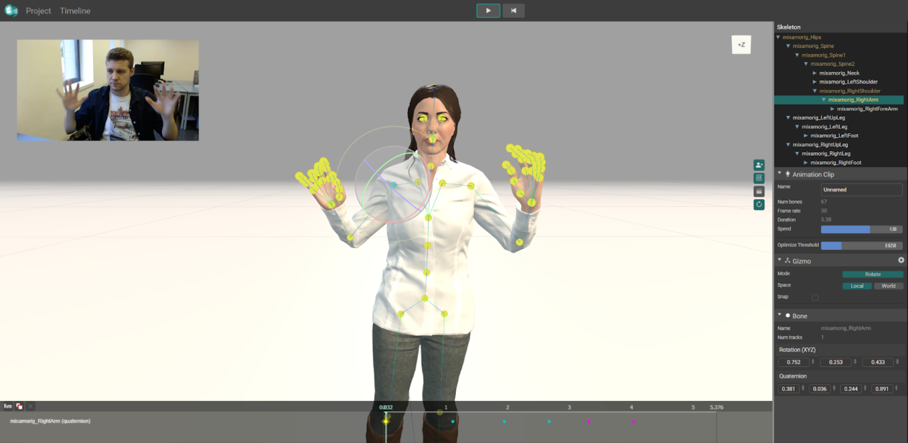

# SignON-editor

This web application estimates computer animations from a single-camera input video. It is hosted in this [link](https://webglstudio.org/projects/signon/animations_editor/).

---
## Description

The first view of the application is a selector of the provided input. It supports pre-recorded videos or the video stream from the webcam, and it can also load previous created animations for editing purposes.

In the following station, the user can trim the video if desired, or select the option "redo" to record/upload the video again. Once the user is fine with the result, the option "Convert Data to 3D Animation" moves the application to the last view.

The last station is a viewer and an editor of the final estimated animation. User can edit/correct as desired the animation with the help of a timeline and an GUI to move the joints of the skeleton.

Finally, user can download the animation as a BVH format file to use it in any other applications with different purposes.

## Libraries

* [ThreeJS](https://github.com/mrdoob/three.js/)
* [Mediapipe](https://github.com/google/mediapipe)
* [TensorflowJS](https://github.com/tensorflow/tfjs)
* [LiteGUI](https://github.com/jagenjo/litegui.js)
* [w2ui](https://github.com/vitmalina/w2ui)

## Authors

Víctor Ubieto (victorubieto)
Pablo García (PZerua)
Eva Valls (evallsg)
Alex Rodríguez (jxarco)
Jaume Pozo (japopra)

This application was created with the budget from the European project SignON (https://signon-project.eu/). And it is planned to be a tool for creating animations that will be used in the project.