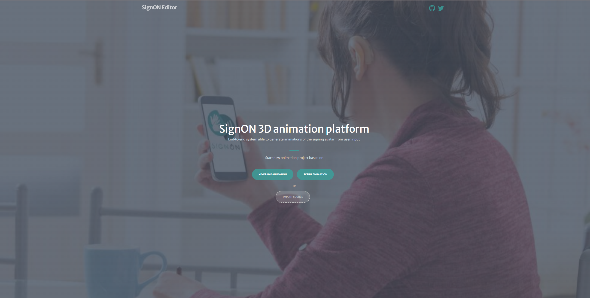

# SignON-editor

This web application estimates computer animations from a single-camera input video. It is hosted in this [link](https://webglstudio.org/projects/signon/animations_editor/).

## Description

The first view of the application is a selector of the provided input. It supports pre-recorded videos or the video stream from the webcam. It can also load previously created animations for editing purposes.

Loading a video or capturing it live through the webcam redirects the user to the video editing stage. Here the resulting video can be trimmed if desired and/or redo the video by recording it again or uploading a new one. Once the user is fine with the result, the option "Convert Data to 3D Animation" moves the application to the last view.

The last station is a viewer and an editor of the final estimated animation. The application converts the video (2D) into a 3D animation through a diverse set of Machine Learning (ML) techniques. Since the output might not be perfect, the editor allows the user to edit/correct as desired the animation with the help of a timeline and a GUI to move the joints of the skeleton.

Finally, the user can download the animation as a BVH format file to use it in any other applications with different purposes.

## Editor GUI

### Top Bar

It contains (ordered from left to right):
- The SignON logo linked to the oficial project link
- The _Project_ button with some editing options
- The _Timeline_ button with some timeline editing options and shortcuts
- Play/Pause button
- Restart button

### Side panel
The panel on the right is divided into four sections. 
- The _Skeleton_ heriarchy shows the different bones and their relations. It provides also a quick way to find and select a specific bone by name
- _Animation Clip_ shows generic information about the animation like the name and duration of the animation. The playback speed can be adjusted through the "speed" slider.
- _Gizmo_ changes some settings of the rotation tool (the ball on the shoulder of the avatar ). The gear button offers some options such as making the yellow joint points biggers/smaller.
- _Bone_ offers the possibility of directly modifying the rotation values by writing them instead of using the in-scene tool

### Scene
The center of the screen shows the scene with the avatar in a pose, determined by the animation frames and the current time in the timeline.

Clicking on a bone (yellow point) selects that joint. The ball with several lines that appears allows the user to rotates that joint in different axes by just clicking and dragging in the desired axis.
The coloured axes are the typical perpendicular axes: red x-axis, green y-axis and blue z-axis. The outer circle rotates in the same plane as the camera is showing.

The buttons in the right side (not in the side panel) shows/hides the skeleton (lines) and the joints points for a clearer view

To move the camera position of the scene either left-click and drag in it (not on a bone) to orbit or right-click and drag to move the camera sideways. Scrolling zooms in and out (up to certain limits).

### Timeline
The timeline located at the bottom of the screen, shows a point for each frame of the animation of the selected bone. Each bone has its own track. Dragging the the timeline moves the current selected time, thus changing the pose in which the avatar is. To modify a frame, a point in the timeline needs to be selected, which will change colour into yellow. When a rotation is performed through the gizmo, the dot will become purple.
Right clicking in the timeline allows to insert a new frame or deleting an existing one.
The timeline can be zoomed in and out.

## Libraries

* [ThreeJS](https://github.com/mrdoob/three.js/)
* [Mediapipe](https://github.com/google/mediapipe)
* [TensorflowJS](https://github.com/tensorflow/tfjs)
* [LiteGUI](https://github.com/jagenjo/litegui.js)
* [w2ui](https://github.com/vitmalina/w2ui)

## Authors

Víctor Ubieto (victorubieto)  
Pablo García (PZerua)  
Eva Valls (evallsg)  
Alex Rodríguez (jxarco)  
Jaume Pozo (japopra)  

This application was created with the budget from the European project SignON (https://signon-project.eu/). And it is planned to be a tool for creating animations that will be used in the project.
